# day18 x盾滑块

https://dun.163.com/trial/jigsaw


# 1.前置知识点


## 1.1 混淆处理

https://cstaticdun.126.net/2.25.0/core-optimi.v2.25.0.min.js?v=2843207

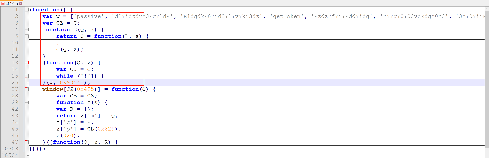

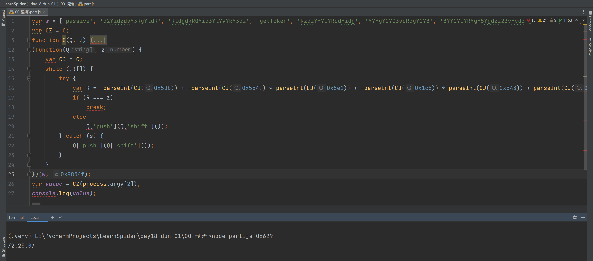


后续如果分析某个函数时，可以讲代码片段拿到，替换后进行分析：

```python
import re
import subprocess

def exec_value(hex_string):
    res = subprocess.check_output(f"node part.js {hex_string}")
    char_string = res.decode('utf-8').strip()
    return char_string

def run():
    with open("f1.js", mode='r', encoding='utf-8') as f1, open("f2.js", mode='w', encoding='utf-8') as f2:
        for line in f1:
            if not line:
                f2.write(line)
                continue
            match_list = re.findall(r"(kq\((.*?)\))", line)
            for total, arg in match_list:
                real_value = exec_value(arg)
                line = line.replace(total, f'"{real_value}"')
            f2.write(line)

if __name__ == '__main__':
    run()
```

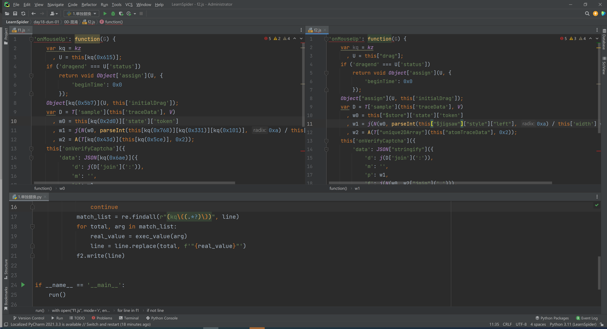


## 1.2 滑块识别

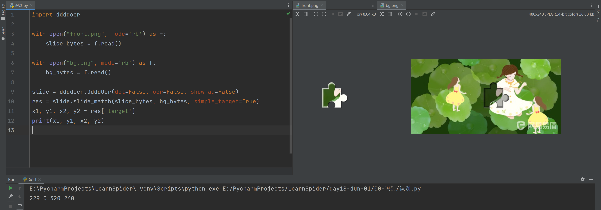

```
pip install ddddocr
```

```python
import ddddocr

with open("front.png", mode='rb') as f:
    slice_bytes = f.read()

with open("bg.png", mode='rb') as f:
    bg_bytes = f.read()

slide = ddddocr.DdddOcr(det=False, ocr=False, show_ad=False)
res = slide.slide_match(slice_bytes, bg_bytes, simple_target=True)
x1, y1, x2, y2 = res['target']
print(x1, y1, x2, y2)
```


## 1.3 赋值和调试

如果在逆向过程中遇到：`某参数 = window.xxxx`，此时又找不到谁给`windows.xxxx`赋值。那么就可以选择：

```javascript
(function(){
    'use strict';
    var gdxidpyhxde = "";
    Object.defineProperty(window, 'gdxidpyhxde', {
       set: function(val) {
               console.log('Hook值', val);
               debugger;
               gdxidpyhxde = val;
               return val;
       },
       get: function()
       {
           return gdxidpyhxde;
       }
    });
})()
```


然后在charles中根据请求的地址，替换成自己的页面。


# 2.获取配置参数


## 2.1 id

id是个固定值，应该是某个公司购买之后，给发放的账号标识。


打个断点，然后根据调用栈网上找，就可以看到这个固定字符串。


## 2.2 代码示例

```python
import json
import random
import requests
import string

callback_string = f"__JSONP_{''.join(random.sample(string.ascii_letters, 7)).lower()}_1"
res = requests.get(
    url="https://c.dun.163.com/api/v2/getconf",
    params={
        "referer": "https%3A%2F%2Fdun.163.com%2Ftrial%2Fjigsaw",
        "zoneId": "",
        "id": "07e2387ab53a4d6f930b8d9a9be71bdf",
        "ipv6": "false",
        "runEnv": "10",
        "iv": "3",
        "type": "2",
        "loadVersion": "2.4.0",
        "callback": callback_string
    },
    headers={
        "Referer": "https://dun.163.com/",
        "User-Agent": "Mozilla/5.0 (Windows NT 10.0; Win64; x64) AppleWebKit/537.36 (KHTML, like Gecko) Chrome/119.0.0.0 Safari/537.36",
    },
)
res.close()
res_string = res.text.strip(f"{callback_string}(").strip(");")
res_dict = json.loads(res_string)
print(res_dict)
```


# 3.获取背景图

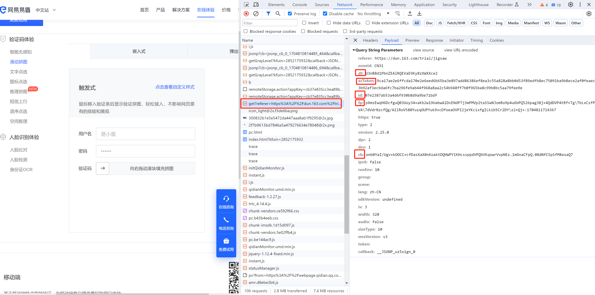


```
     id: 固定
     dt: getconf请求返回dt
acToken: getconf请求返回token（有些情况时值不同，但按照相同携带没问题）
     fp: 【需逆向】
     cb: 【需逆向】
```


## 3.1 动态参数和调试

有动态参数的存在，无法进行调试。

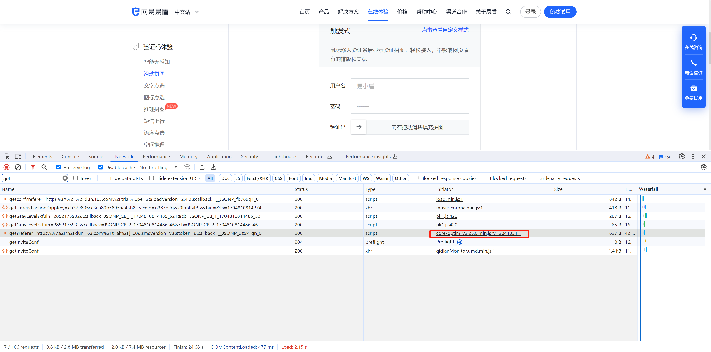


而此js文件是通过其他js文件动态加载出来的。

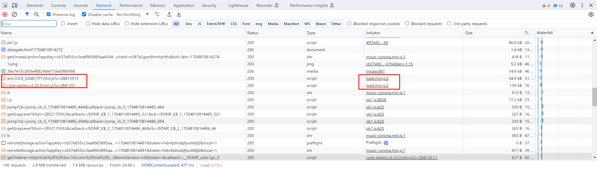

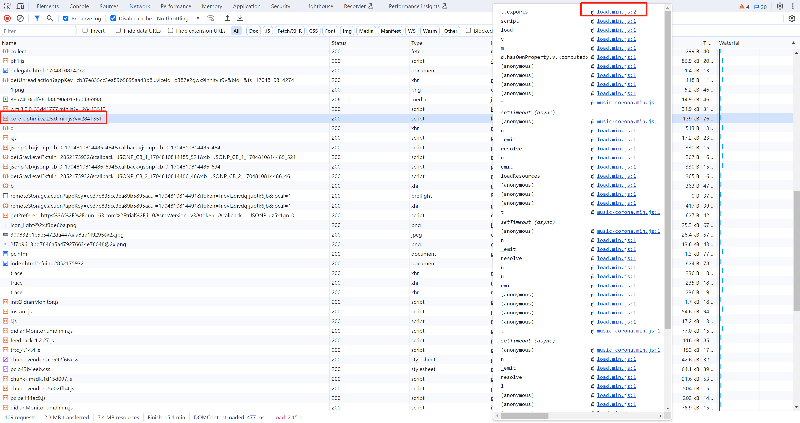

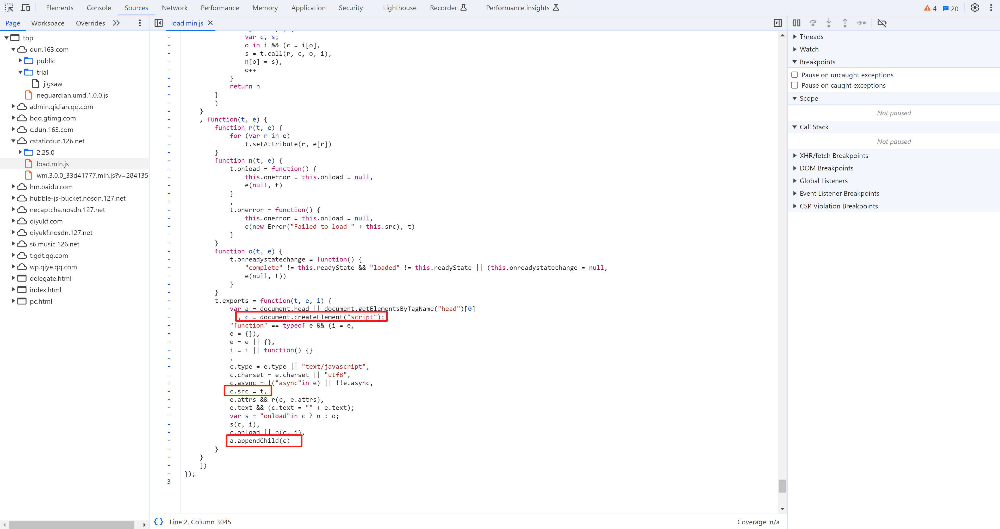

发现这个t参数就是js文件的地址，例如：

```
https://cstaticdun.126.net/wm.3.0.0_33d41777.min.js?v=28396079
https://cstaticdun.126.net/2.25.0/core-optimi.v2.25.0.min.js?v=2839607
```


所以，可以在charles中修改 load.min.js 文件，并对请求进行替换。

```javascript
t = t.split("?")[0];
```


重新刷新页面，js文件变为固定：

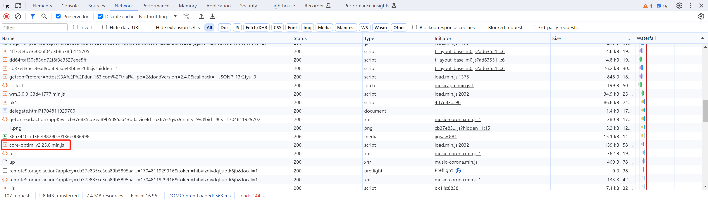


## 3.2 调试和调用栈


## 3.3 cb

```
'cb': w1()
```


进入w1函数进行分析，发现里面涉及的东西有点多，分析实现起来比较麻烦。

索性，尝试补环境直接调用试试。

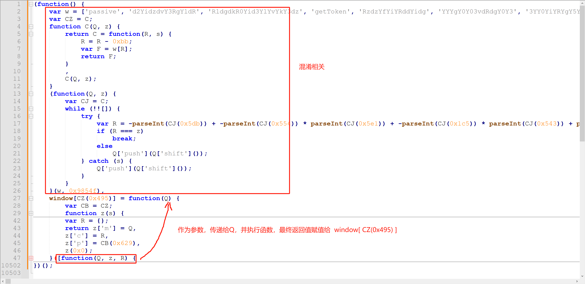


### 1.补环境

索性，将整个js文件进行执行，然后找到 w1 函数，将他赋值到 window.w1 函数中，便于后续调用执行。

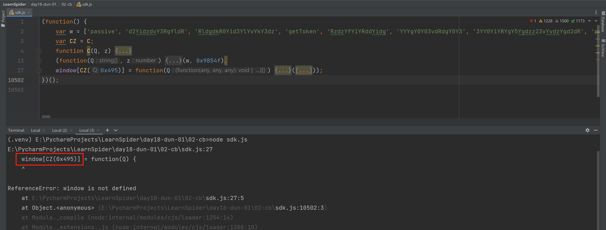


补个基础环境，再重新试试：

```javascript
const jsdom = require("jsdom");
const {JSDOM} = jsdom;

const html = `<!DOCTYPE html><p>Hello world</p>`;
const dom = new JSDOM(html, {
    url: "https://dun.163.com/trial/jigsaw",
    referrer: "https://dun.163.com/",
    contentType: "text/html"
});
document = dom.window.document;

window = global;
Object.assign(global, {
    location: {
        hash: "",
        host: "dun.163.com",
        hostname: "dun.163.com",
        href: "https://dun.163.com/trial/jigsaw",
        origin: "https://dun.163.com/",
        pathname: "/trial/jigsaw",
        port: "",
        protocol: "https:",
        search: "",
    },
    navigator: {
        appCodeName: "Mozilla",
        appName: "Netscape",
        appVersion: "5.0 (Macintosh; Intel Mac OS X 10_15_7) AppleWebKit/537.36 (KHTML, like Gecko) Chrome/93.0.4577.82 Safari/537.36",
        cookieEnabled: true,
        deviceMemory: 8,
        doNotTrack: null,
        hardwareConcurrency: 4,
        language: "zh-CN",
        languages: ["zh-CN", "zh"],
        maxTouchPoints: 0,
        onLine: true,
        platform: "MacIntel",
        product: "Gecko",
        productSub: "20030107",
        userAgent: "Mozilla/5.0 (Macintosh; Intel Mac OS X 10_15_7) AppleWebKit/537.36 (KHTML, like Gecko) Chrome/93.0.4577.82 Safari/537.36",
        vendor: "Google Inc.",
        vendorSub: "",
        webdriver: false
    }
});

```

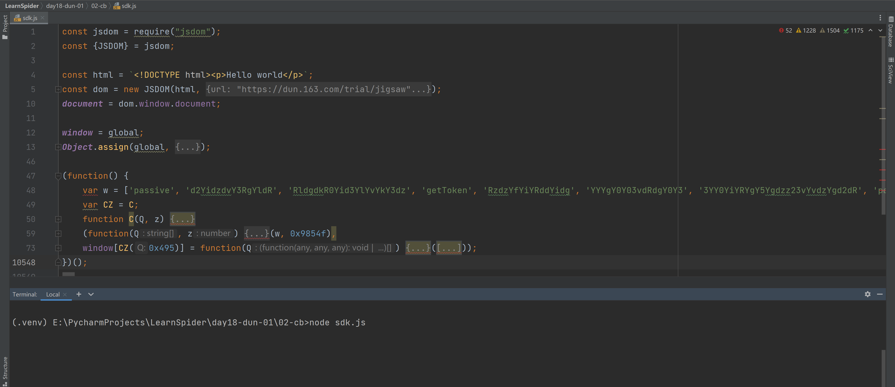

结果，**发现卡死了**。。。这是为啥呢？ 

### 2.卡壳了

是因为 setTimeout函数导致（分析fp时发现的）。

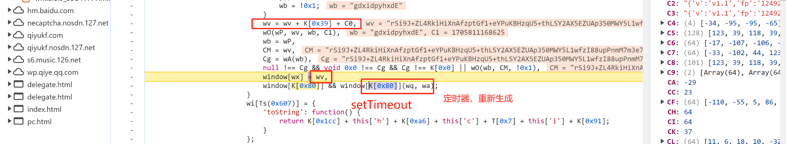


所以，在补环境时，设置一下，就可以了。

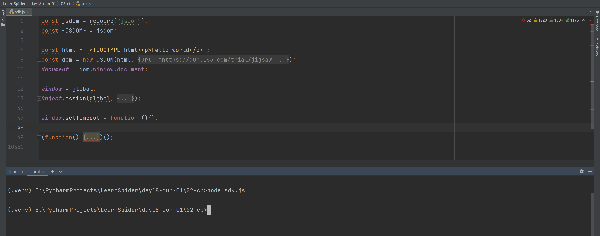


### 3.定义和调用

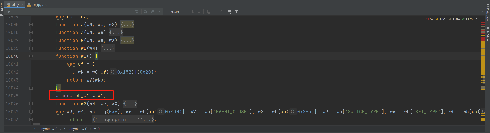

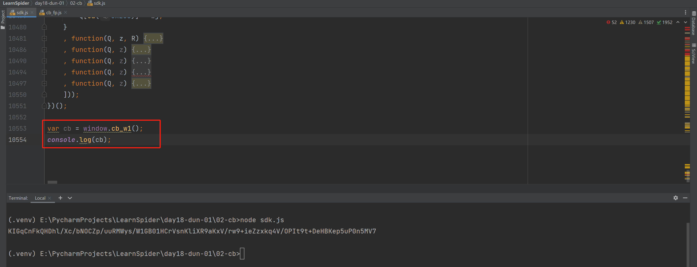

```javascript
var cb = window.cb_w1();
console.log(cb);
```


## 3.4 fp

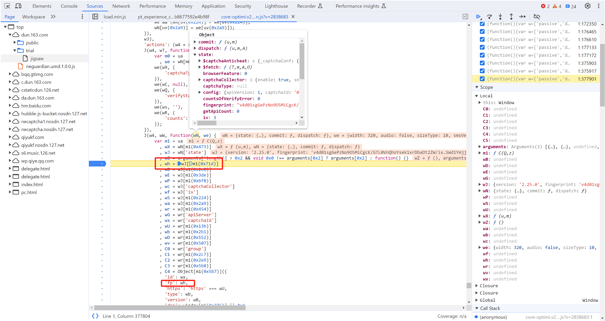


找上一个调用栈：

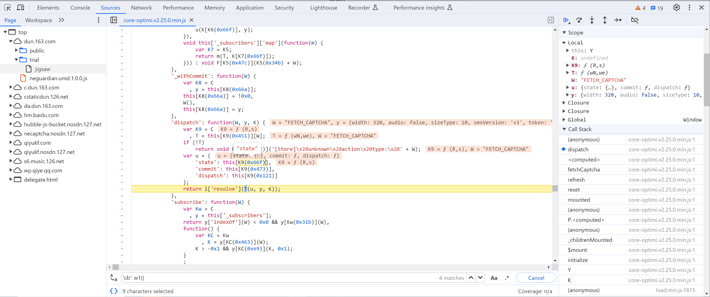


向上找，看看谁给state赋值的？


断点，重新刷新：


```javascript
var wW = window["gdxidpyhxde"];
```

注意：在这里也可以尝试直接调用。


fp在icon请求的cookie中也出现了，说明他很早的时就生成了。


到底是谁哪里生成？然后又赋值给了 `window["gdxidpyhxde"]`？


### 1.调试赋值

```javascript
(function(){
    'use strict';
    var gdxidpyhxde = "";
    Object.defineProperty(window, 'gdxidpyhxde', {
       set: function(val) {
               console.log('Hook值', val);
               debugger;
               gdxidpyhxde = val;
               return val;
       },
       get: function()
       {
           return gdxidpyhxde;
       }
    });
})()
```


然后在charles中根据请求的地址，替换成自己的页面。


### 2.调试


### 3.直接调用生成

在cb的环境基础上，直接调用生成。

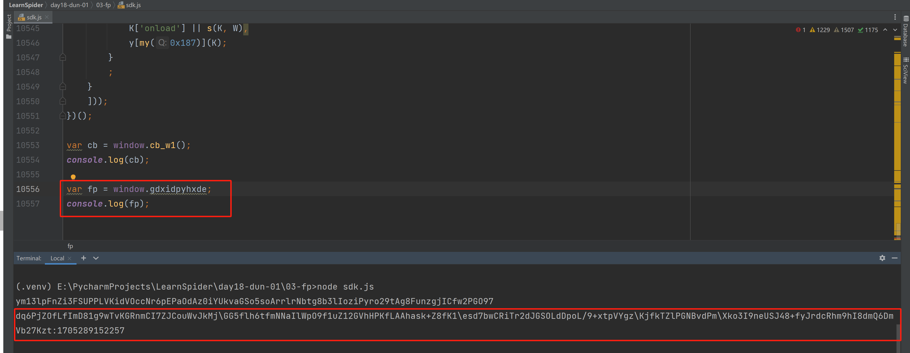

```javascript
var fp = window.gdxidpyhxde;
console.log(fp);
```


## 3.5 代码示例

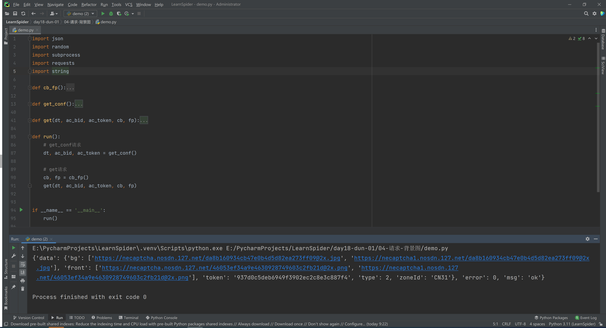

```python
import json
import random
import subprocess
import requests
import string


def cb_fp():
    res = subprocess.check_output("node sdk.js")
    char_string = res.decode('utf-8').strip()
    cb, fp = char_string.strip().split()
    return cb, fp


def get_conf():
    callback_string = f"__JSONP_{''.join(random.sample(string.ascii_letters, 7)).lower()}_1"
    res = requests.get(
        url="https://c.dun.163.com/api/v2/getconf",
        params={
            "referer": "https%3A%2F%2Fdun.163.com%2Ftrial%2Fjigsaw",
            "zoneId": "",
            "id": "07e2387ab53a4d6f930b8d9a9be71bdf",
            "ipv6": "false",
            "runEnv": "10",
            "iv": "3",
            "type": "2",
            "loadVersion": "2.4.0",
            "callback": callback_string
        },
        headers={
            "Referer": "https://dun.163.com/",
            "User-Agent": "Mozilla/5.0 (Windows NT 10.0; Win64; x64) AppleWebKit/537.36 (KHTML, like Gecko) Chrome/119.0.0.0 Safari/537.36",
        },
    )
    res.close()
    res_string = res.text.strip(f"{callback_string}(").strip(");")
    res_dict = json.loads(res_string)
    dt = res_dict['data']['dt']
    ac_bid = res_dict['data']['ac']['bid']
    ac_token = res_dict['data']['ac']['token']
    return dt, ac_bid, ac_token


def get(dt, ac_bid, ac_token, cb, fp):
    callback_string = f"__JSONP_{''.join(random.sample(string.ascii_letters, 7)).lower()}_1"

    res = requests.get(
        url="https://c.dun.163.com/api/v3/get",
        params={
            "referer": "https%3A%2F%2Fdun.163.com%2Ftrial%2Fjigsaw",
            "zoneId": "CN31",
            "dt": dt,
            "acToken": ac_token,
            "id": ac_bid,
            "fp": fp,
            "https": "true",
            "type": "2",
            "version": "2.25.0",
            "dpr": "2",
            "dev": "1",
            "cb": cb,
            "ipv6": "false",
            "runEnv": "10",
            "group": "",
            "scene": "",
            "lang": "zh-CN",
            "sdkVersion": "undefined",
            "iv": "3",
            "width": "320",
            "audio": "false",
            "sizeType": "10",
            "smsVersion": "v3",
            "token": "",
            "callback": callback_string
        },
        headers={
            # "Accept-Language": "zh-CN,zh;q=0.9",
            "Referer": "https://dun.163.com/",
            "User-Agent": "Mozilla/5.0 (Windows NT 10.0; Win64; x64) AppleWebKit/537.36 (KHTML, like Gecko) Chrome/119.0.0.0 Safari/537.36",
        },

    )
    res.close()
    res_string = res.text.strip(f"{callback_string}(").strip(");")
    res_dict = json.loads(res_string)
    print(res_dict)


def run():
    # get_conf请求
    dt, ac_bid, ac_token = get_conf()

    # get请求
    cb, fp = cb_fp()
    get(dt, ac_bid, ac_token, cb, fp)


if __name__ == '__main__':
    run()
```


# 4.提交滑块


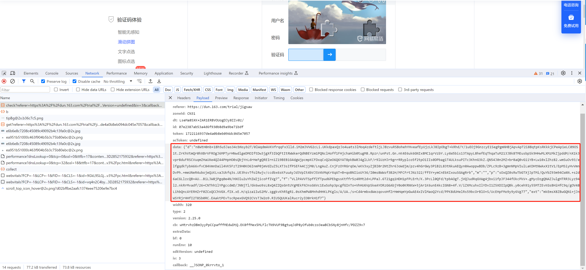

```
referer: https://dun.163.com/trial/jigsaw
zoneId: CN31
dt: LseMa8SXK+ZAR1ERBVOUogDJy8IIv0z/       getconf请求返回dt
id: 07e2387ab53a4d6f930b8d9a9be71bdf       固定
token: 1722116937de4a0b8eb094dc045e7057    get请求返回
acToken: undefined
data: {"d":"n8WtH0h5u5Ja...IO0rkH1f7"}    【核心】应该是滑块的轨迹信息
width: 320
type: 2
version: 2.25.0
cb: wHtrvhzDBm3yy...DZZ9v7                尝试get请求中的cb算法
extraData: 
bf: 0
runEnv: 10
sdkVersion: undefined
iv: 3
callback: __JSONP_0krrvto_1
```


## 4.1 调用栈

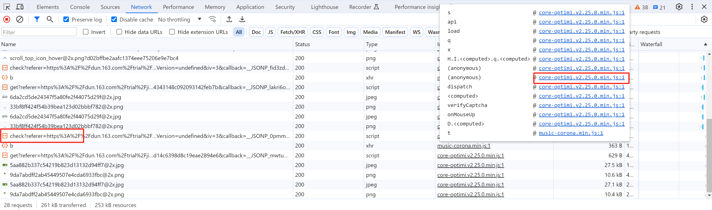


```javascript
 'data': JSON["stringify"]({
     'd': j(D['join'](':')),
     'm': '',
     'p': w1,
     'f': j(N(w0, w2["join"](','))),
     'ext': j(N(w0, this["mouseDownCounts"] + ',' + this['traceData']['length']))
 })
```

将混淆代码替换后：

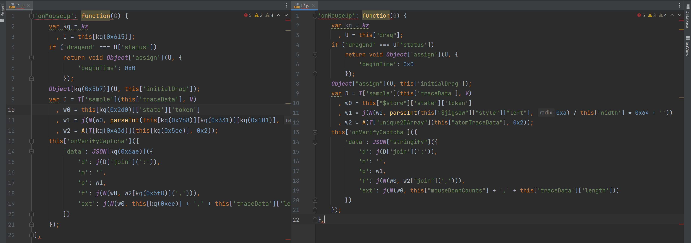


## 4.2 d

```javascript
var D = T['sample'](this['traceData'], V)

'data': JSON["stringify"]({
     'd': j(D['join'](':')),   // 分析逆向
     'm': '',
     'p': w1,
     'f': j(N(w0, w2["join"](','))),
     'ext': j(N(w0, this["mouseDownCounts"] + ',' + this['traceData']['length']))
 })
```

分析代码可知：

- `this['traceData']`，应该是滑动轨迹。
- `T['sample']`，函数是取轨迹的前50条数据。
- `D['join'](':')`，是拼接前50条轨迹。
- `j`，是对拼接后的轨迹进行算法处理


### 1.轨迹

**MouseUp** 是鼠标起来后触发执行，滑块的轨迹应该是在 **MouseMove** 中生成。

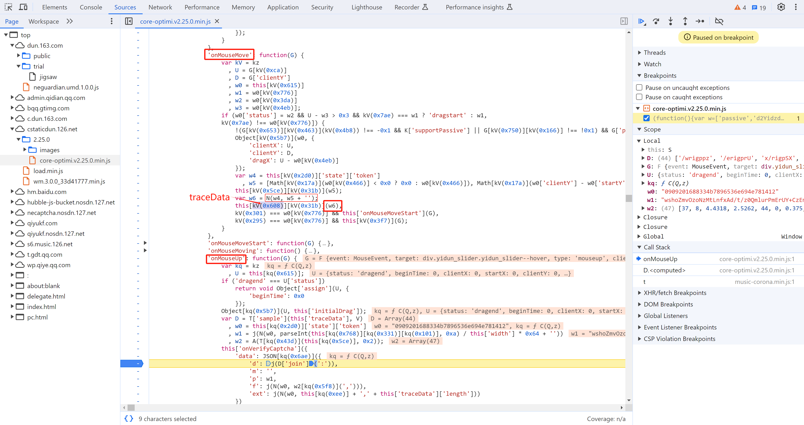


可以在 **MouseMove** 中断点测试：


局部混淆替换：

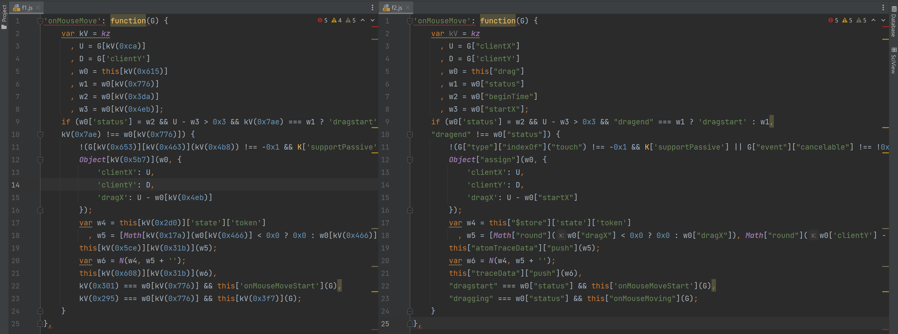

```javascript
'onMouseMove': function(G) {
    U = G["clientX"];
    D = G['clientY'];
    
    w0 = this["drag"];
    w3 = w0["startX"];
    
    Object["assign"](w0, {
        'clientX': U,
        'clientY': D,
        'dragX': U - w0["startX"]
    });
    
    var w4 = this["$store"]['state']['token'];
    var w5 = [
        Math["round"](w0["dragX"]), 
        Math["round"](w0['clientY'] - w0['startY']), 
        T["now"]() - w0["beginTime"]
    ];

    var w6 = N(w4, w5 + '');
    this["traceData"]["push"](w6)
}
```

```javascript
// w4=获取背景图请求时返回的 "token": "e867c0f9eae1434aa0c8ffc7cfde6021"

// w5 = [Math["round"](拖动x坐标-起始x坐标), Math["round"](拖动y坐标-起始u坐标), 当前时间-开始时间];
// 例如：w5 = [5,0,327]

var w6 = N(w4, w5 + '');
this["traceData"]["push"](w6),
```


### 2.w6= N(...)

轨迹的`traceData`是个列表，每个元素是调用 `N(w4,w5+"") `得到。

```javascript
w4=获取背景图请求时返回的 "token": "e867c0f9eae1434aa0c8ffc7cfde6021"
w5 = [Math["round"](拖动x坐标-起始x坐标), Math["round"](拖动y坐标-起始u坐标), 当前时间-开始时间];
```

接下来，搞定N算法，那么就搞定轨迹了。


调试定位N函数：

```
w4 = "cc7c74c959d842e69aa980a3430b7884"
w5 = '5,-1,92'

结果：vZF2rwa+rp33
```

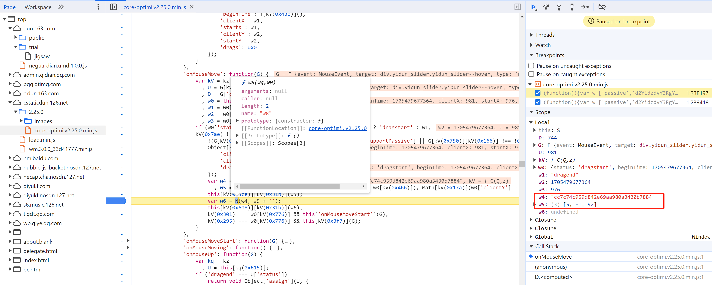

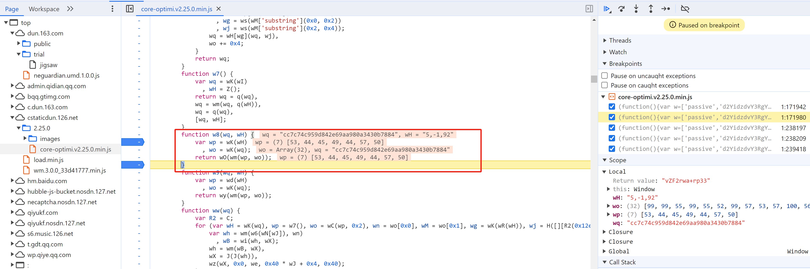


### 3.N函数（简易版）

将w8函数赋值到window中，然后再尝试直接调用。然后再对比结果是否一致。

结果一致。

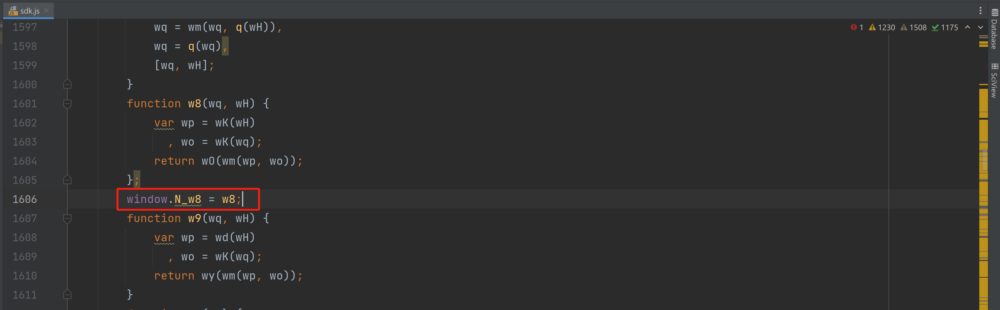

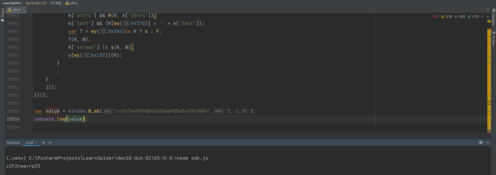


### 4.N函数（扣代码版）

分析N函数的调用栈，一步步找到他的调用代码。

```javascript
function F(N) {
    return N < -0x80 ? F(0x100 + N) : N > 0x7f ? F(N - 0x100) : N;
}

function A(N) {
    N = '' + N;
    for (var X = [], J = 0x0, Z = 0x0, B = N['length'] / 0x2; J < B; J++) {
        var E = parseInt(N['charAt'](Z++), 0x10) << 0x4
            , P = parseInt(N['charAt'](Z++), 0x10);
        X[J] = F(E + P);
    }
    return X;
}

function O(N) {
    //N = window["encodeURIComponent"](N);
    N = encodeURIComponent(N);
    for (var X = [], J = 0x0, Z = N["length"]; J < Z; J++)
        '%' === N["charAt"](J) ? J + 0x2 < Z && X["push"](A('' + N['charAt'](++J) + N["charAt"](++J))[0x0]) : X['push'](F(N["charCodeAt"](J)));
    return X;
}


function T_wm() {
    for (var N = arguments['length'] > 0x0 && void 0x0 !== arguments[0x0] ? arguments[0x0] : [], X = arguments['length'] > 0x1 && void 0x0 !== arguments[0x1] ? arguments[0x1] : [], J = [], Z = X['length'], B = 0x0, E = N['length']; B < E; B++)
        J[B] = K(N[B], X[B % Z]);
    return J;
}

function K(N, X) {
    return F(F(N) ^ F(X));
}


function T_wO(q) {
    var H = ['i', '/', 'x', '1', 'X', 'g', 'U', '0', 'z', '7', 'k', '8', 'N', '+', 'l', 'C', 'p', 'O', 'n', 'P', 'r', 'v', '6', '\x5c', 'q', 'u', '2', 'G', 'j', '9', 'H', 'R', 'c', 'w', 'T', 'Y', 'Z', '4', 'b', 'f', 'S', 'J', 'B', 'h', 'a', 'W', 's', 't', 'A', 'e', 'o', 'M', 'I', 'E', 'Q', '5', 'm', 'D', 'd', 'V', 'F', 'L', 'K', 'y']
        , M = '3';
    return k(q, H, M);
}

function k(q, H, M) {
    if (!q || 0x0 === q['length'])
        return '';
    try {
        for (var j = 0x0, N = []; j < q['length'];) {
            if (!(j + 0x3 <= q['length'])) {
                var X = q['slice'](j);
                N['push'](NewF(X, H, M));
                break;
            }
            var J = q['slice'](j, j + 0x3);
            N['push'](NewF(J, H, M)),
                j += 0x3;
        }
        return N['join']('');
    } catch (Z) {
        return '';
    }
}

function NewF(q, H, M) {
    var j = void 0x0
        , N = void 0x0
        , X = void 0x0
        , J = [];
    switch (q['length']) {
        case 0x1:
            j = q[0x0],
                N = X = 0x0,
                J['push'](H[j >>> 0x2 & 0x3f], H[(j << 0x4 & 0x30) + (N >>> 0x4 & 0xf)], M, M);
            break;
        case 0x2:
            j = q[0x0],
                N = q[0x1],
                X = 0x0,
                J['push'](H[j >>> 0x2 & 0x3f], H[(j << 0x4 & 0x30) + (N >>> 0x4 & 0xf)], H[(N << 0x2 & 0x3c) + (X >>> 0x6 & 0x3)], M);
            break;
        case 0x3:
            j = q[0x0],
                N = q[0x1],
                X = q[0x2],
                J['push'](H[j >>> 0x2 & 0x3f], H[(j << 0x4 & 0x30) + (N >>> 0x4 & 0xf)], H[(N << 0x2 & 0x3c) + (X >>> 0x6 & 0x3)], H[0x3f & X]);
            break;
        default:
            return '';
    }
    return J['join']('');
}

function N_as_w8(wq, wH) {
    var wp = O(wH);  // wK(wH)
    var wo = O(wq); // wK(wq)
    // return wO(wm(wp, wo));
    return T_wO(T_wm(wp, wo));
}

var res = N_as_w8(process.argv[2], process.argv[3]);
console.log(res);
```


### 5.轨迹traceData

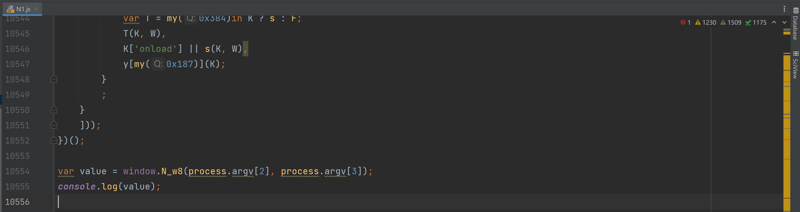

```python
import subprocess
import random


def N_w8(v1, v2):
    res = subprocess.check_output(f"node N1.js {v1} {v2}")
    res = res.decode('utf-8').strip()
    return res


def run():
    # 识别滑块的距离
    x_distance = 100
    # 背景请求返回的token
    bg_token = "cc7c74c959d842e69aa980a3430b7884"

    trace_data = []
    interval_value = random.randint(100, 300)
    step = 2
    for i in range(0, x_distance + 1, step):
        x_value = i + step
        if x_value > x_distance:
            x_value = x_distance
        interval_value += random.randint(10, 20)
        y_value = random.randint(0, 5)

        # trace_data
        line = f"{x_value},{y_value},{interval_value}"
        line = N_w8(bg_token, line)
        trace_data.append(line)
    print(trace_data)


if __name__ == '__main__':
    run()

```


### 6.前50

```javascript
var D = T['sample'](this['traceData'], V)

'data': JSON["stringify"]({
     'd': j(D['join'](':')),
     'm': '',
     'p': w1,
     'f': j(N(w0, w2["join"](','))),
     'ext': j(N(w0, this["mouseDownCounts"] + ',' + this['traceData']['length']))
 })
```

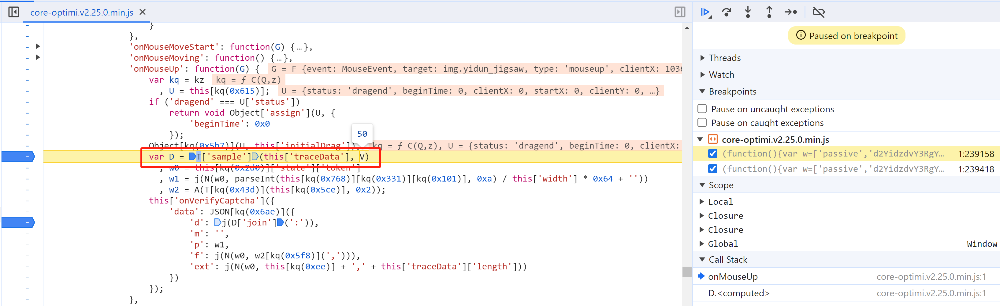

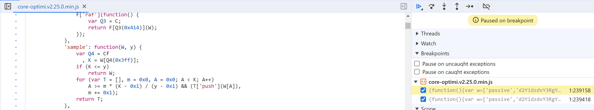


### 7.j函数

```javascript
var D = T['sample'](this['traceData'], V)

'data': JSON["stringify"]({
     'd': j(D['join'](':')),
     'm': '',
     'p': w1,
     'f': j(N(w0, w2["join"](','))),
     'ext': j(N(w0, this["mouseDownCounts"] + ',' + this['traceData']['length']))
 })
```

获取轨迹之后，先使用`:`将轨迹数据拼接，然后再执行 `j`函数，最终生成 d 的结果。

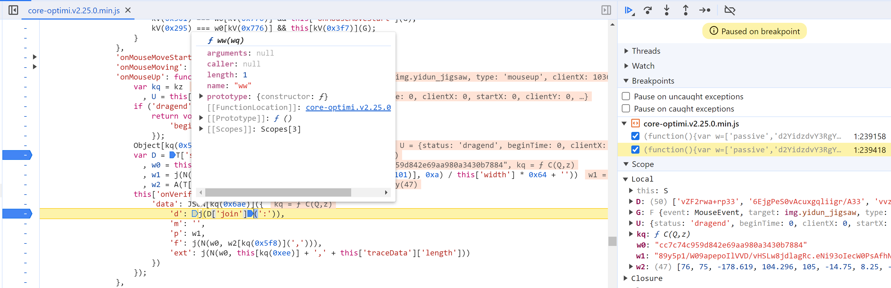


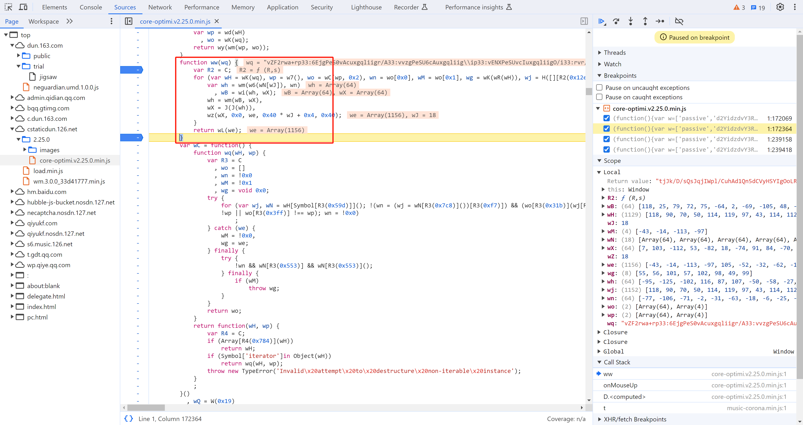


直接在环境中补充，尝试调用：

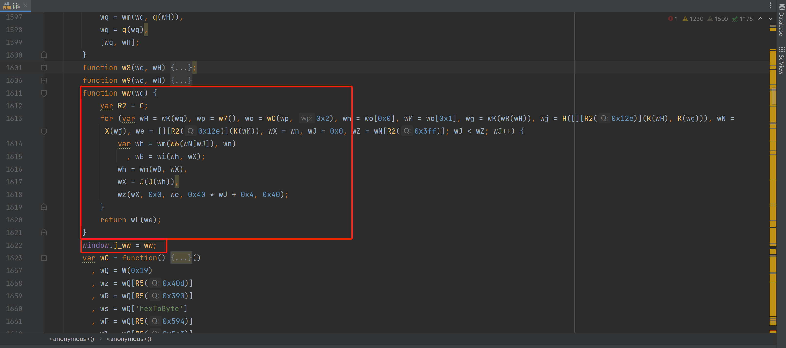

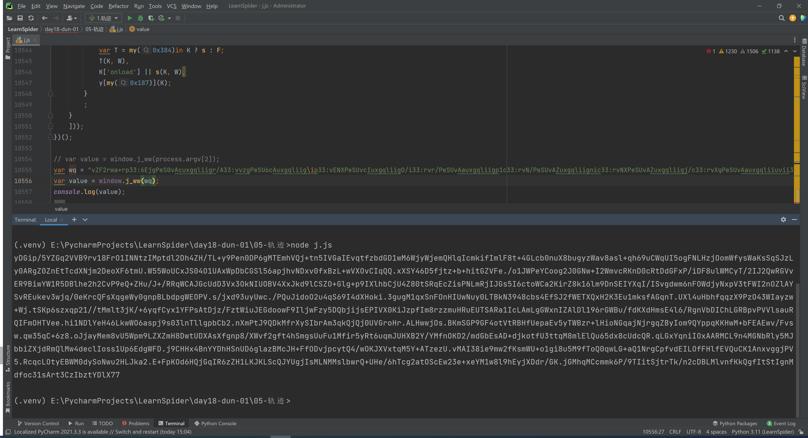

注意：动态的结果每次都不一样，所以此处就没办法验证（先假设正确）。


### 8.d实现（示例代码）

```python
import subprocess
import random


def N_w8(v1, v2):
    res = subprocess.check_output(f"node N1.js {v1} {v2}")
    res = res.decode('utf-8').strip()
    return res


def j_as_ww(v1):
    res = subprocess.check_output(f"node j.js {v1}")
    res = res.decode('utf-8').strip()
    return res


def run():
    # 识别滑块的距离
    x_distance = 100
    # 背景请求返回的token
    bg_token = "cc7c74c959d842e69aa980a3430b7884"

    trace_data = []
    interval_value = random.randint(100, 300)
    step = 2
    for i in range(0, x_distance + 1, step):
        x_value = i + step
        if x_value > x_distance:
            x_value = x_distance
        interval_value += random.randint(10, 20)
        y_value = random.randint(0, 5)

        # trace_data
        line = f"{x_value},{y_value},{interval_value}"
        line = N_w8(bg_token, line)
        trace_data.append(line)

    d_string = j_as_ww(":".join(trace_data[0:50]))
    print(d_string)


if __name__ == '__main__':
    run()

```


## 4.3 p

```javascript
var D = T['sample'](this['traceData'], V)

'data': JSON["stringify"]({
     'd': j(D['join'](':')),
     'm': '',
     'p': w1,
     'f': j(N(w0, w2["join"](','))),
     'ext': j(N(w0, this["mouseDownCounts"] + ',' + this['traceData']['length']))
 })
```


```javascript
// this["$jigsaw"]["style"]["left"]  是滑块左滑的像素【滑动时，页面上标签会生成left属性，表示滑动的距离】
// this['width']背景图宽度，固定320

// w0= "bd1911673b7348ca9ae553b2fc6930d7"   get请求返回的token
// N=w8函数  【同d算法中的N=w8函数】
// j函数     【同】

p = w1 = j(   N(w0,   parseInt(   this["$jigsaw"]["style"]["left"], 0xa)  /  this['width'] * 0x64    + '')    )
```


直接带入参数并实现：

```python
import subprocess


def N_w8(v1, v2):
    res = subprocess.check_output(f"node N1.js {v1} {v2}")
    res = res.decode('utf-8').strip()
    return res


def j_as_ww(v1):
    res = subprocess.check_output(f"node j.js {v1}")
    res = res.decode('utf-8').strip()
    return res


def run():
    # 识别滑块的距离
    x_distance = 100
    # 背景请求返回的token
    bg_token = "cc7c74c959d842e69aa980a3430b7884"

    p_string = j_as_ww(N_w8(bg_token, str(x_distance / 320 * 100)))
    print(p_string)


if __name__ == '__main__':
    run()
```


## 4.4 f

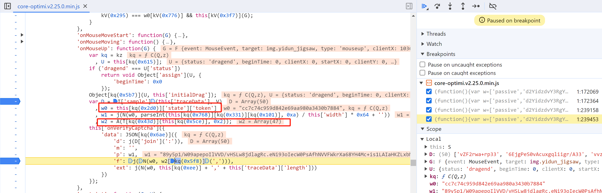

```javascript
w0 = this[kq(0x2d0)]['state']['token'];
w2 = A(T["unique2DArray"](this["atomTraceData"], 0x2));

'data': JSON["stringify"]({
     'd': j(D['join'](':')),
     'm': '',
     'p': w1,
     'f': j(N(w0, w2["join"](','))),
     'ext': j(N(w0, this["mouseDownCounts"] + ',' + this['traceData']['length']))
 })
```


### 1.atomTraceData

```javascript
w0 = this[kq(0x2d0)]['state']['token'];
w2 = A(T["unique2DArray"](this["atomTraceData"], 0x2));

'data': JSON["stringify"]({
     'd': j(D['join'](':')),
     'm': '',
     'p': w1,
     'f': j(N(w0, w2["join"](','))),
     'ext': j(N(w0, this["mouseDownCounts"] + ',' + this['traceData']['length']))
 })
```

其实是类似TraceData的指纹信息，只不过格式不同而已。

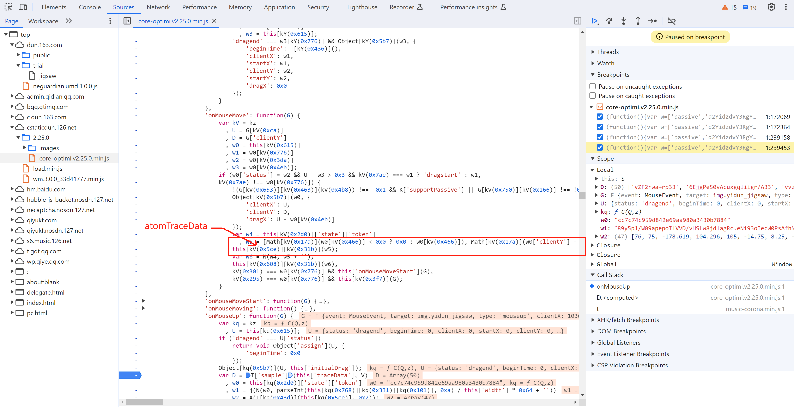

这个列表存储的就直接是w5（轨迹信息），类似于：

```
this['atomTraceData'] = [ 
	[4, 0, 203],
	[5, 0, 211],
	[6, 0, 227],
	...
]
```

所以，可以直接在生成TraceData的时候，一起生成，例如：

```python
import subprocess
import random


def N_w8(v1, v2):
    res = subprocess.check_output(f"node N2.js {v1} {v2}")
    res = res.decode('utf-8').strip()
    return res


def run():
    # 识别滑块的距离
    x_distance = 100
    # 背景请求返回的token
    bg_token = "cc7c74c959d842e69aa980a3430b7884"

    trace_data = []
    atom_trace_data = []

    interval_value = random.randint(100, 300)
    step = 2
    for i in range(0, x_distance + 1, step):
        x_value = i + step
        if x_value > x_distance:
            x_value = x_distance
        interval_value += random.randint(10, 20)
        y_value = random.randint(0, 5)
        # atom_trace_data
        chunk_list = [x_value, y_value, interval_value]
        atom_trace_data.append(chunk_list)

        # trace_data
        line = f"{x_value},{y_value},{interval_value}"
        line = N_w8(bg_token, line)
        trace_data.append(line)

    print(atom_trace_data)
    print(trace_data)


if __name__ == '__main__':
    run()
```


### 2.unique2DArray

```javascript
w0 = this[kq(0x2d0)]['state']['token'];
w2 = A(T["unique2DArray"](this["atomTraceData"], 0x2));

'data': JSON["stringify"]({
     'd': j(D['join'](':')),
     'm': '',
     'p': w1,
     'f': j(N(w0, w2["join"](','))),
     'ext': j(N(w0, this["mouseDownCounts"] + ',' + this['traceData']['length']))
 })
```

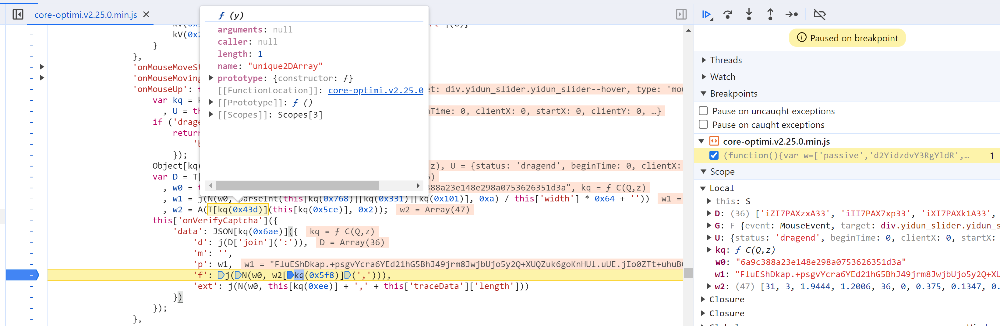

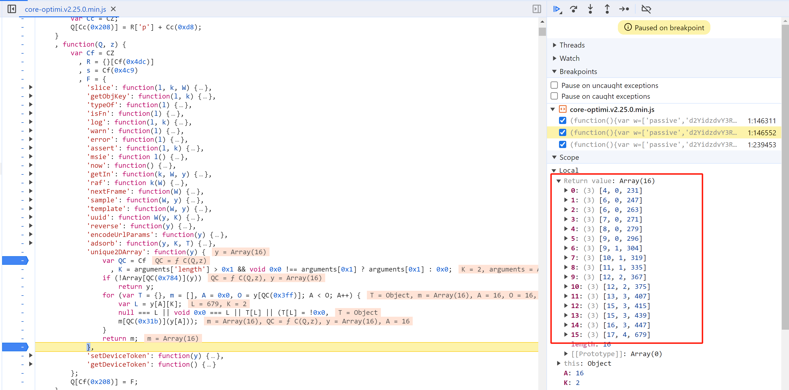

可以将此函数赋值给window再调用，例如：

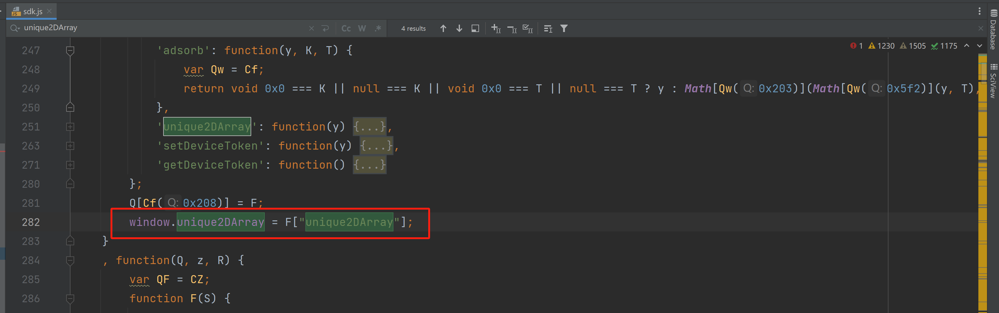

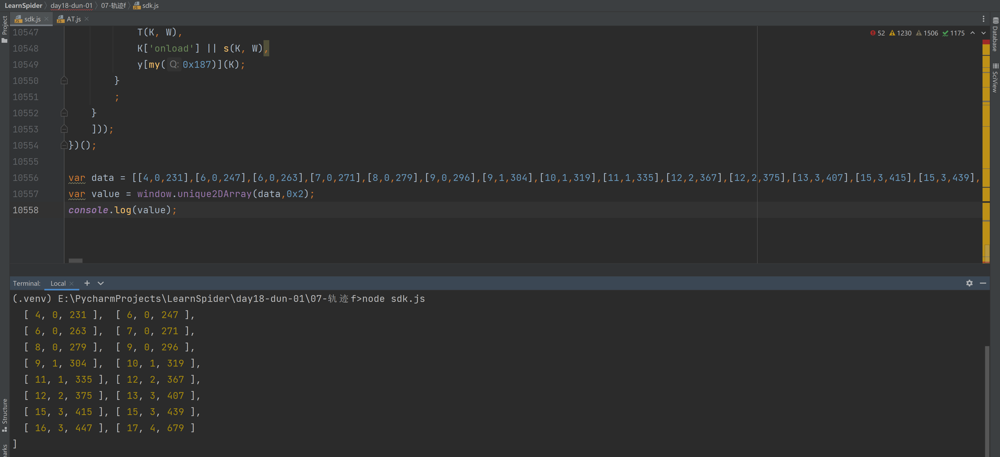


### 3.A函数

```javascript
w0 = this[kq(0x2d0)]['state']['token'];
w2 = A(T["unique2DArray"](this["atomTraceData"], 0x2));

'data': JSON["stringify"]({
     'd': j(D['join'](':')),
     'm': '',
     'p': w1,
     'f': j(N(w0, w2["join"](','))),
     'ext': j(N(w0, this["mouseDownCounts"] + ',' + this['traceData']['length']))
 })
```

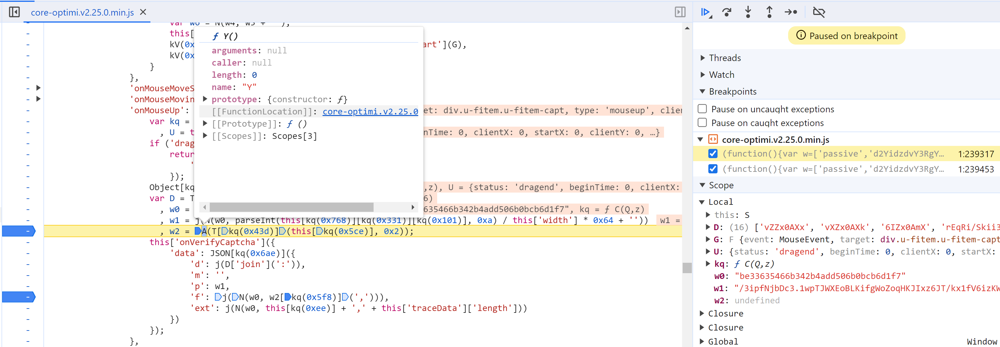

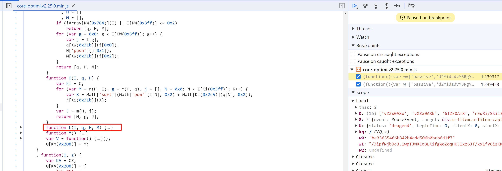

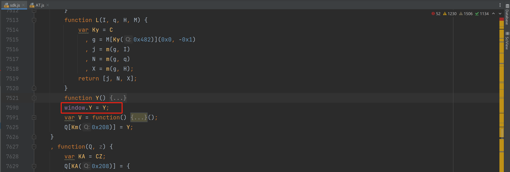

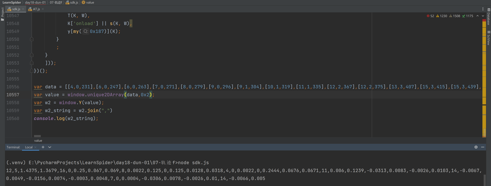


### 4.j和N函数

```javascript
w0 = this[kq(0x2d0)]['state']['token'];
w2 = A(T["unique2DArray"](this["atomTraceData"], 0x2));

'data': JSON["stringify"]({
     'd': j(D['join'](':')),
     'm': '',
     'p': w1,
     'f': j(N(w0, w2["join"](','))),
     'ext': j(N(w0, this["mouseDownCounts"] + ',' + this['traceData']['length']))
 })
```

- j函数、N函数与之前的函数相同，直接调用即可。

- w0是图片请求返回的token。

所以，不需要逆向了，直接用代码去调用生成就行了。


### 5.f实现（示例代码）

```python
import subprocess
import random
import json


def N_w8(v1, v2):
    res = subprocess.check_output(f"node N2.js {v1} {v2}")
    res = res.decode('utf-8').strip()
    return res


def A_unique2DArray(v1):
    res = subprocess.check_output(f"node w2.js {v1}")
    res = res.decode('utf-8').strip()
    return res


def j_as_ww(v1):
    res = subprocess.check_output(f"node j.js {v1}")
    res = res.decode('utf-8').strip()
    return res


def run():
    # 识别滑块的距离
    x_distance = 100
    # 背景请求返回的token
    bg_token = "cc7c74c959d842e69aa980a3430b7884"

    trace_data = []
    atom_trace_data = []
    interval_value = random.randint(100, 300)
    step = 2
    for i in range(0, x_distance + 1, step):
        x_value = i + step
        if x_value > x_distance:
            x_value = x_distance
        interval_value += random.randint(10, 20)
        y_value = random.randint(0, 5)
        # atom_trace_data
        chunk_list = [x_value, y_value, interval_value]
        atom_trace_data.append(chunk_list)

        # trace_data
        line = f"{x_value},{y_value},{interval_value}"
        line = N_w8(bg_token, line)
        trace_data.append(line)

    # print(atom_trace_data)
    w2_string = A_unique2DArray(json.dumps(atom_trace_data, separators=(',', ':')))
    f_string = j_as_ww(N_w8(bg_token, w2_string))

    print(f_string)

if __name__ == '__main__':
    run()
```

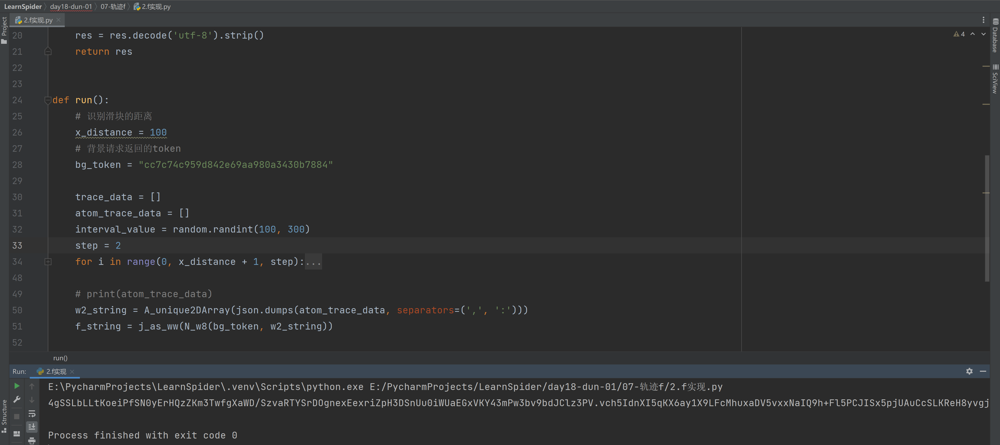


## 4.5 ext

```javascript
w0 = this[kq(0x2d0)]['state']['token'];
w2 = A(T["unique2DArray"](this["atomTraceData"], 0x2));

'data': JSON["stringify"]({
     'd': j(D['join'](':')),
     'm': '',
     'p': w1,
     'f': j(N(w0, w2["join"](','))),
     'ext': j(N(w0, this["mouseDownCounts"] + ',' + this['traceData']['length']))
 })
```

- j函数、N函数与之前的函数相同，直接调用即可。

- w0是图片请求返回的token。
- `this["mouseDownCounts"] = 1` 
- `this['traceData']['length']` 滑块轨迹的长度


直接用代码实现即可：

```python
import subprocess
import random
import json


def N_w8(v1, v2):
    res = subprocess.check_output(f"node N2.js {v1} {v2}")
    res = res.decode('utf-8').strip()
    return res


def j_as_ww(v1):
    res = subprocess.check_output(f"node j.js {v1}")
    res = res.decode('utf-8').strip()
    return res


def run():
    # 识别滑块的距离
    x_distance = 100
    # 背景请求返回的token
    bg_token = "cc7c74c959d842e69aa980a3430b7884"

    trace_data = []
    atom_trace_data = []
    interval_value = random.randint(100, 300)
    step = 2
    for i in range(0, x_distance + 1, step):
        x_value = i + step
        if x_value > x_distance:
            x_value = x_distance
        interval_value += random.randint(10, 20)
        y_value = random.randint(0, 5)
        # atom_trace_data
        chunk_list = [x_value, y_value, interval_value]
        atom_trace_data.append(chunk_list)

        # trace_data
        line = f"{x_value},{y_value},{interval_value}"
        line = N_w8(bg_token, line)
        trace_data.append(line)

    ext_string = j_as_ww(N_w8(bg_token, f"1,{len(trace_data)}"))
    print(ext_string)


if __name__ == '__main__':
    run()
```


## 4.6 提交滑块（识别率低）


分析至此data中的所有参数已全逆向出来：

```javascript
'data': JSON["stringify"]({
     'd': j(D['join'](':')),
     'm': '',
     'p': w1,
     'f': j(N(w0, w2["join"](','))),
     'ext': j(N(w0, this["mouseDownCounts"] + ',' + this['traceData']['length']))
 })
```

其他参数要么是固定 或 其他请求返回：

```
referer: https://dun.163.com/trial/jigsaw
zoneId: CN31
dt: LseMa8SXK+ZAR1ERBVOUogDJy8IIv0z/       getconf请求返回dt
id: 07e2387ab53a4d6f930b8d9a9be71bdf       固定
token: 1722116937de4a0b8eb094dc045e7057    get请求返回
acToken: undefined
data: {"d":"n8WtH0h5u5Ja...IO0rkH1f7"}    【核心】应该是滑块的轨迹信息
width: 320
type: 2
version: 2.25.0
cb: wHtrvhzDBm3yy...DZZ9v7                尝试get请求中的cb算法
extraData: 
bf: 0
runEnv: 10
sdkVersion: undefined
iv: 3
callback: __JSONP_0krrvto_1
```


所以，接下来就可以整合代码发送请求提交滑块。

```python
import json
import random
import subprocess
import ddddocr
import requests
import string


def N_as_w8(v1, v2):
    res = subprocess.check_output(f"node N2.js {v1} {v2}")
    res = res.decode('utf-8').strip()
    return res


def j_as_ww(v1):
    res = subprocess.check_output(f"node j.js {v1}")
    res = res.decode('utf-8').strip()
    return res


def cb_fp():
    res = subprocess.check_output("node cb_fp.js")
    char_string = res.decode('utf-8').strip()
    cb, fp = char_string.strip().split()
    return cb, fp


def A_unique2DArray(v1):
    res = subprocess.check_output(f"node w2.js {v1}")
    res = res.decode('utf-8').strip()
    return res


def get_conf():
    callback_string = f"__JSONP_{''.join(random.sample(string.ascii_letters, 7)).lower()}_1"
    res = requests.get(
        url="https://c.dun.163.com/api/v2/getconf",
        params={
            "referer": "https%3A%2F%2Fdun.163.com%2Ftrial%2Fjigsaw",
            "zoneId": "",
            "id": "07e2387ab53a4d6f930b8d9a9be71bdf",
            "ipv6": "false",
            "runEnv": "10",
            "iv": "3",
            "type": "2",
            "loadVersion": "2.4.0",
            "callback": callback_string
        },
        headers={
            "Referer": "https://dun.163.com/",
            "User-Agent": "Mozilla/5.0 (Windows NT 10.0; Win64; x64) AppleWebKit/537.36 (KHTML, like Gecko) Chrome/119.0.0.0 Safari/537.36",
        },
    )
    res.close()
    res_string = res.text.strip(f"{callback_string}(").strip(");")
    res_dict = json.loads(res_string)
    dt = res_dict['data']['dt']
    ac_bid = res_dict['data']['ac']['bid']
    ac_token = res_dict['data']['ac']['token']
    return dt, ac_bid, ac_token


def get(dt, ac_bid, ac_token, cb, fp):
    callback_string = f"__JSONP_{''.join(random.sample(string.ascii_letters, 7)).lower()}_1"

    res = requests.get(
        url="https://c.dun.163.com/api/v3/get",
        params={
            "referer": "https%3A%2F%2Fdun.163.com%2Ftrial%2Fjigsaw",
            "zoneId": "CN31",
            "dt": dt,
            "acToken": ac_token,
            # "acToken": "undefined",
            "id": ac_bid,
            "fp": fp,
            "https": "true",
            "type": "2",
            "version": "2.25.0",
            "dpr": "2",
            "dev": "1",
            "cb": cb,
            "ipv6": "false",
            "runEnv": "10",
            "group": "",
            "scene": "",
            "lang": "zh-CN",
            "sdkVersion": "undefined",
            "iv": "3",
            "width": "320",
            "audio": "false",
            "sizeType": "10",
            "smsVersion": "v3",
            "token": "",
            "callback": callback_string
        },
        # cookies=cookie_dict,
        headers={
            "Accept-Language": "zh-CN,zh;q=0.9",
            "Referer": "https://dun.163.com/",
            "User-Agent": "Mozilla/5.0 (Windows NT 10.0; Win64; x64) AppleWebKit/537.36 (KHTML, like Gecko) Chrome/119.0.0.0 Safari/537.36",
        },

    )
    res.close()
    res_string = res.text.strip(f"{callback_string}(").strip(");")
    res_dict = json.loads(res_string)
    bg_url = res_dict['data']['bg'][0]
    front_url = res_dict['data']['front'][0]
    bg_token = res_dict['data']['token']
    bg_type = res_dict['data']['type']
    bg_zone_id = res_dict['data']['zoneId']
    return bg_url, front_url, bg_token, bg_type, bg_zone_id


def slide_match(front_url, bg_url):
    slice_bytes = requests.get(front_url).content
    with open("front.png", mode='wb') as f:
        f.write(slice_bytes)
    bg_bytes = requests.get(bg_url).content
    with open("bg.png", mode='wb') as f:
        f.write(bg_bytes)

    slide = ddddocr.DdddOcr(det=False, ocr=False, show_ad=False)
    res = slide.slide_match(slice_bytes, bg_bytes, simple_target=True)
    x1, y1, x2, y2 = res['target']
    # print(x1, y1, x2, y2)  # 114 45 194 125
    return int(x1 / 1.5)


def gen_trace_data(bg_token, x_distance):
    atom_trace_data = []
    trace_data = []

    interval_value = random.randint(100, 300)
    step = 2
    for i in range(0, x_distance + 1, step):
        x_value = i + step
        if x_value > x_distance:
            x_value = x_distance
        interval_value += random.randint(10, 20)
        y_value = random.randint(0, 5)

        # atom_trace_data
        chunk_list = [x_value, y_value, interval_value]
        atom_trace_data.append(chunk_list)

        # trace_data
        line = f"{x_value},{y_value},{interval_value}"
        line = N_as_w8(bg_token, line)
        trace_data.append(line)

    return trace_data, atom_trace_data


def run():
    # get_conf请求
    dt, ac_bid, ac_token = get_conf()

    # get请求
    cb, fp = cb_fp()
    bg_url, front_url, bg_token, bg_type, bg_zone_id = get(dt, ac_bid, ac_token, cb, fp)

    # 识别
    x_distance = slide_match(front_url, bg_url)
    # x_distance = slide_match2(front_url, bg_url)
    # 轨迹数据
    trace_data, atom_trace_data = gen_trace_data(bg_token, x_distance + 11)
    d_string = j_as_ww(":".join(trace_data[0:50]))
    m_string = ""
    p_string = j_as_ww(N_as_w8(bg_token, str(x_distance / 320 * 100)))
    w2_string = A_unique2DArray(json.dumps(atom_trace_data, separators=(',', ':')))
    f_string = j_as_ww(N_as_w8(bg_token, w2_string))
    ext_string = j_as_ww(N_as_w8(bg_token, f"1,{len(trace_data)}"))

    #
    data_string = json.dumps({
        "d": d_string,
        "m": m_string,
        "p": p_string,
        "f": f_string,
        "ext": ext_string,
    }, separators=(',', ':'))

    cb, fp = cb_fp()
    callback_string = f"__JSONP_{''.join(random.sample(string.ascii_letters, 7)).lower()}_1"
    params = {
        "referer": "https://dun.163.com/trial/jigsaw",
        "zoneId": bg_zone_id,
        "dt": dt,
        "id": ac_bid,
        "token": bg_token,
        "acToken": "undefined",
        "data": data_string,
        "width": "320",
        "type": "2",
        "version": "2.25.0",
        "cb": cb,
        "extraData": "",
        "bf": "0",
        "runEnv": "10",
        "sdkVersion": "undefined",
        "iv": "3",
        "callback": callback_string
    }
    res = requests.get(
        url="https://c.dun.163.com/api/v3/check",
        params=params,
        headers={
            "Accept-Language": "zh-CN,zh;q=0.9",
            "Referer": "https://dun.163.com/",
            "User-Agent": "Mozilla/5.0 (Windows NT 10.0; Win64; x64) AppleWebKit/537.36 (KHTML, like Gecko) Chrome/119.0.0.0 Safari/537.36",
        },
    )
    res.close()
    print(res.text)


if __name__ == '__main__':
    for i in range(10):
        run()

```

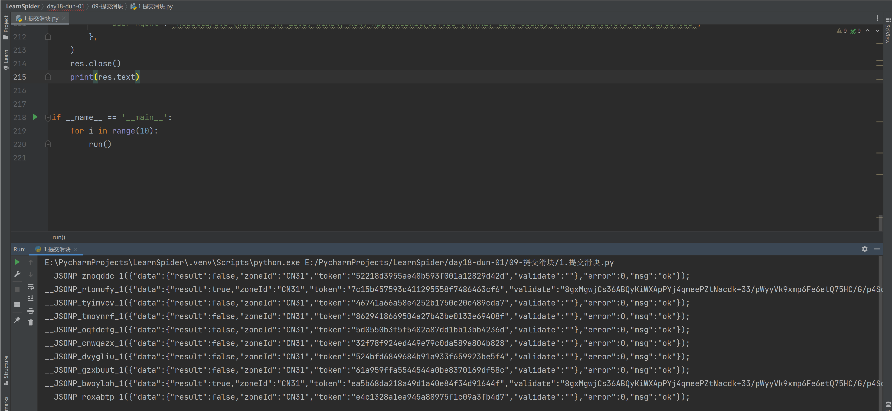


## 4.7 提交滑块

如果解决识别率低的问题？我做过很多的尝试和测试，发现影响识别率的就是两个因素：

- fp算法，需要逐步调试fp的代码执行过程 vs 本地执行js的过程，值和值进行比较对比。

  

- 请求头

  ```python
  res = requests.get(
      url="https://c.dun.163.com/api/v3/check",
      params=params,
      headers={
          "Accept-Language": "zh-CN,zh;q=0.9",    # 影响识别率
          "Referer": "https://dun.163.com/",
          "User-Agent": "Moz6",
      },
  )
  ```

  


```python
import json
import random
import subprocess
import ddddocr
import requests
import string


def N_as_w8(v1, v2):
    res = subprocess.check_output(f"node N2.js {v1} {v2}")
    res = res.decode('utf-8').strip()
    return res


def j_as_ww(v1):
    res = subprocess.check_output(f"node j.js {v1}")
    res = res.decode('utf-8').strip()
    return res


def cb_fp():
    res = subprocess.check_output("node cb_fp.js")
    char_string = res.decode('utf-8').strip()
    cb, fp = char_string.strip().split()
    return cb, fp


def A_unique2DArray(v1):
    res = subprocess.check_output(f"node w2.js {v1}")
    res = res.decode('utf-8').strip()
    return res


def get_conf():
    callback_string = f"__JSONP_{''.join(random.sample(string.ascii_letters, 7)).lower()}_1"
    res = requests.get(
        url="https://c.dun.163.com/api/v2/getconf",
        params={
            "referer": "https%3A%2F%2Fdun.163.com%2Ftrial%2Fjigsaw",
            "zoneId": "",
            "id": "07e2387ab53a4d6f930b8d9a9be71bdf",
            "ipv6": "false",
            "runEnv": "10",
            "iv": "3",
            "type": "2",
            "loadVersion": "2.4.0",
            "callback": callback_string
        },
        headers={
            "Referer": "https://dun.163.com/",
            "User-Agent": "Mozilla/5.0 (Windows NT 10.0; Win64; x64) AppleWebKit/537.36 (KHTML, like Gecko) Chrome/119.0.0.0 Safari/537.36",
        },
    )
    res.close()
    res_string = res.text.strip(f"{callback_string}(").strip(");")
    res_dict = json.loads(res_string)
    dt = res_dict['data']['dt']
    ac_bid = res_dict['data']['ac']['bid']
    ac_token = res_dict['data']['ac']['token']
    return dt, ac_bid, ac_token


def get(dt, ac_bid, ac_token, cb, fp):
    callback_string = f"__JSONP_{''.join(random.sample(string.ascii_letters, 7)).lower()}_1"

    res = requests.get(
        url="https://c.dun.163.com/api/v3/get",
        params={
            "referer": "https%3A%2F%2Fdun.163.com%2Ftrial%2Fjigsaw",
            "zoneId": "CN31",
            "dt": dt,
            "acToken": ac_token,
            # "acToken": "undefined",
            "id": ac_bid,
            "fp": fp,
            "https": "true",
            "type": "2",
            "version": "2.25.0",
            "dpr": "2",
            "dev": "1",
            "cb": cb,
            "ipv6": "false",
            "runEnv": "10",
            "group": "",
            "scene": "",
            "lang": "zh-CN",
            "sdkVersion": "undefined",
            "iv": "3",
            "width": "320",
            "audio": "false",
            "sizeType": "10",
            "smsVersion": "v3",
            "token": "",
            "callback": callback_string
        },
        # cookies=cookie_dict,
        headers={
            "Accept-Language": "zh-CN,zh;q=0.9",
            "Referer": "https://dun.163.com/",
            "User-Agent": "Mozilla/5.0 (Windows NT 10.0; Win64; x64) AppleWebKit/537.36 (KHTML, like Gecko) Chrome/119.0.0.0 Safari/537.36",
        },

    )
    res.close()
    res_string = res.text.strip(f"{callback_string}(").strip(");")
    res_dict = json.loads(res_string)
    bg_url = res_dict['data']['bg'][0]
    front_url = res_dict['data']['front'][0]
    bg_token = res_dict['data']['token']
    bg_type = res_dict['data']['type']
    bg_zone_id = res_dict['data']['zoneId']
    return bg_url, front_url, bg_token, bg_type, bg_zone_id


def slide_match(front_url, bg_url):
    slice_bytes = requests.get(front_url).content
    with open("front.png", mode='wb') as f:
        f.write(slice_bytes)
    bg_bytes = requests.get(bg_url).content
    with open("bg.png", mode='wb') as f:
        f.write(bg_bytes)

    slide = ddddocr.DdddOcr(det=False, ocr=False, show_ad=False)
    res = slide.slide_match(slice_bytes, bg_bytes, simple_target=True)
    x1, y1, x2, y2 = res['target']
    # print(x1, y1, x2, y2)  # 114 45 194 125
    return int(x1 / 1.5)


def gen_trace_data(bg_token, x_distance):
    atom_trace_data = []
    trace_data = []

    interval_value = random.randint(100, 300)
    step = 2
    for i in range(0, x_distance + 1, step):
        x_value = i + step
        if x_value > x_distance:
            x_value = x_distance
        interval_value += random.randint(10, 20)
        y_value = random.randint(0, 5)

        # atom_trace_data
        chunk_list = [x_value, y_value, interval_value]
        atom_trace_data.append(chunk_list)

        # trace_data
        line = f"{x_value},{y_value},{interval_value}"
        line = N_as_w8(bg_token, line)
        trace_data.append(line)

    return trace_data, atom_trace_data


def run():
    # get_conf请求
    dt, ac_bid, ac_token = get_conf()

    # get请求
    cb, fp = cb_fp()
    bg_url, front_url, bg_token, bg_type, bg_zone_id = get(dt, ac_bid, ac_token, cb, fp)

    # 识别
    x_distance = slide_match(front_url, bg_url)
    # x_distance = slide_match2(front_url, bg_url)
    # 轨迹数据
    trace_data, atom_trace_data = gen_trace_data(bg_token, x_distance + 11)
    d_string = j_as_ww(":".join(trace_data[0:50]))
    m_string = ""
    p_string = j_as_ww(N_as_w8(bg_token, str(x_distance / 320 * 100)))
    w2_string = A_unique2DArray(json.dumps(atom_trace_data, separators=(',', ':')))
    f_string = j_as_ww(N_as_w8(bg_token, w2_string))
    ext_string = j_as_ww(N_as_w8(bg_token, f"1,{len(trace_data)}"))

    #
    data_string = json.dumps({
        "d": d_string,
        "m": m_string,
        "p": p_string,
        "f": f_string,
        "ext": ext_string,
    }, separators=(',', ':'))

    cb, fp = cb_fp()
    callback_string = f"__JSONP_{''.join(random.sample(string.ascii_letters, 7)).lower()}_1"
    params = {
        "referer": "https://dun.163.com/trial/jigsaw",
        "zoneId": bg_zone_id,
        "dt": dt,
        "id": ac_bid,
        "token": bg_token,
        "acToken": "undefined",
        "data": data_string,
        "width": "320",
        "type": "2",
        "version": "2.25.0",
        "cb": cb,
        "extraData": "",
        "bf": "0",
        "runEnv": "10",
        "sdkVersion": "undefined",
        "iv": "3",
        "callback": callback_string
    }
    res = requests.get(
        url="https://c.dun.163.com/api/v3/check",
        params=params,
        headers={
            "Accept-Language": "zh-CN,zh;q=0.9",
            "Referer": "https://dun.163.com/",
            "User-Agent": "Mozilla/5.0 (Windows NT 10.0; Win64; x64) AppleWebKit/537.36 (KHTML, like Gecko) Chrome/119.0.0.0 Safari/537.36",
        },
    )
    res.close()
    print(res.text)


if __name__ == '__main__':
    for i in range(10):
        run()
```


